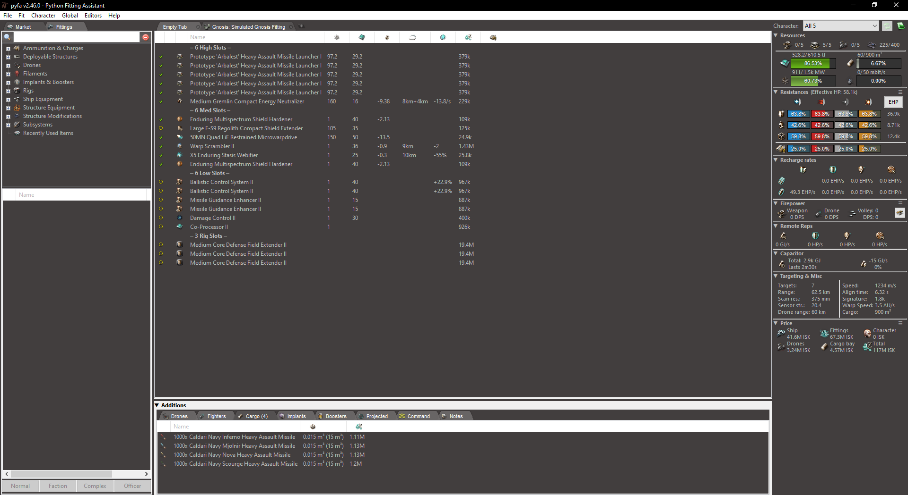

# Pyfa Modification (Darkmode theme)


## What is it
This is a runtime modification to the amazing [**Py**thon **F**itting **A**ssistant](https://github.com/pyfa-org/Pyfa) that implements a pseudo darkmode theme for the Pyfa windows build.
For someone using Pyfa often, the default windows theme colors can be quite strenuous for the eyes. 

Looking at the [Pyfa Issue thread regarding Dark/Nightmode](https://github.com/pyfa-org/Pyfa/issues/1206) a prober solution has never been fully released, so I decided to sit down and make a quick-n-dirty work around to this.


## Installation & Uninstallation
Download [latest release](https://github.com/Eivonz/Pyfa-Mod/releases/latest)

To install copy the file named "oleacc.dll" into the Pyfa installation directory.

To uninstall delete the file named "oleacc.dll" from the Pyfa installation directory.


#### Windows Support (x64)
This should work on at least following Windows versions:
* Windows 10
* Windows 11

#### Pyfa Support
It currently supports the latest version of Pyfa for windows, but this could change in the future with changes made by the Pyfa developers.

## How does it work
When build this solution creates a DLL, that is automatically loaded by Pyfa when placed in the installation directory.

The DLL hooks a specific set of windows functions, modifying the color values.

## Custom colors
It is possible to specify custom colors in an optional .ini file ("oleacc.ini") located in same folder as the .dll file.
```
;
; Pyfa mod Darkmode settings
;
;   Important, colors are specified by their respective RGB hex value and must be prefixed by '0x'
;
;   ColorBackground: Main background color for most window elements
;   ColorText: Color of the text elements
;   UseExperimentalDarkmode: Implementation of some undocumented windows api call, to force certain apps into a darkmode state.
;   EnableLogging: Write log output to a .log file
;
[settings]
ColorBackground = 0x686868
ColorText = 0xBCBCBC
UseExperimentalDarkmode = true
EnableLogging = false
```

### ToDo
* Better support for native controls still colored in default windows colors.
* ~~User customizable colors.~~
* ~~Rework hooking mechanics.~~

## Contact:
Any issues can be submitted using the [issue](https://github.com/Eivonz/Pyfa-Mod/issues) system.
* I can be contacted through following:
    * EvE: Eibon Ravnsborg
    * Email: mail@eibon.net


## Resources
* [Pyfa repository](https://github.com/pyfa-org/Pyfa)
* [Pyfa Issue thread regarding Dark/Nightmode](https://github.com/pyfa-org/Pyfa/issues/1206)


