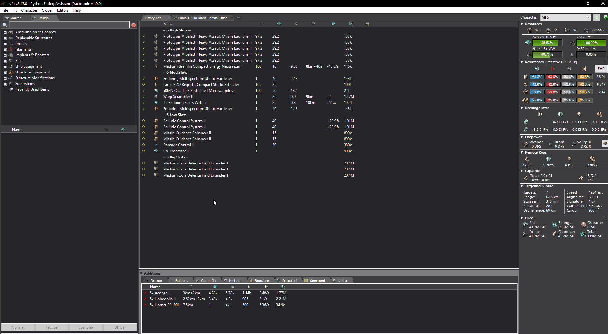

# Pyfa Modification (Darkmode theme)


## What is it
This is a runtime modification to the amazing [**Py**thon **F**itting **A**ssistant](https://github.com/pyfa-org/Pyfa) that implements a pseudo darkmode theme for the Pyfa windows build.
For someone using Pyfa often, the default windows theme colors can be quite strenuous for the eyes. 

Looking at the [Pyfa Issue thread regarding Dark/Nightmode](https://github.com/pyfa-org/Pyfa/issues/1206) a prober solution has never been fully released, so I decided to sit down and make a ~~quick~~-n-dirty work around to this.


## Installation & Uninstallation
Download the .zip file named "release_###.zip" from [latest release](https://github.com/Eivonz/Pyfa-Mod/releases/latest)

To install copy the files named "oleacc.dll" and "oleacc.ini" into the Pyfa installation directory.

To uninstall delete the file named "oleacc.dll" from the Pyfa installation directory.


#### Windows Support (x64)
This should work on at least following Windows versions:
* Windows 10
* Windows 11

#### Pyfa Support
It currently supports the latest version of Pyfa for windows, but this could change in the future with changes made by the Pyfa developers.

## How does it work
When build this solution creates a DLL, that is automatically loaded by Pyfa when placed in the installation directory.

The DLL hooks a specific set of windows functions, modifying the color values.


## Available Themes
From version v1.0.0 it is possible to select one of multiple color themes. To change theme add or update the entry **"ActiveThemePalette"** in the [Configuration file](#configuration-file).

#### Included themes:
<table>
  <tr>
    <td>
      
    </td>
    <td>
      
    </td>
    <td>
      
    </td>
    <td>
      
    </td>
  </tr>
  <tr>
    <td align="center">BlackBeauty (1) <br/> Default</td>
    <td align="center">Licorice (2)</td>
    <td align="center">LicoriceBlue (3)</td>
    <td align="center">Daintree (4)</td>
  </tr>
</table>

#### Custom theme
It is possible to specify your own color theme using the **"OverrideThemePalette"** entry in the [Configuration file](#configuration-file).


<details>
  <summary> Deprecated </summary>

### Configuration file
The optional file **"oleacc.ini"** contains custom settings, and can be freely edited.

For any changes to take effect, Pyfa must be restarted.

```
;
; Pyfa mod Darkmode settings
;
;   ActiveThemePalette [OPTIONAL, Boolean, Default=1]
;	Indicate which of the available color themes to use. (ex. "ActiveThemePalette = 3" to use the LicoriceBlue color theme)
;	Available color themes: 1 = BlackBeauty, 2 = Licorice, 3 = LicoriceBlue, 4 = BlackBeauty
;
;   OverrideThemePalette [OPTIONAL, Comma separated string]
;	Specify a string of (5) comma separated RGB hex colors to use as theme palette, ordered from darkest to lightest.
;	Valid RGB hex format prefix are #, 0x or nothing.
;	(ex. OverrideThemePalette = #521ecc, #e68ca1, #1a2070, #a85294, #aaccb5)
;
;   EnableCustomControls[OPTIONAL, Boolean, Default = true]
;	Indicates if the standard windows controls will be colored by the active theme palette.
;
;   UseExperimentalDarkmode [OPTIONAL, Boolean, Default = true]
;	Implementation of some undocumented windows api call, to force certain apps into a darkmode state.
;
;   EnableLogging [OPTIONAL, Boolean, Default = false]
;	Write log output to a .log file.
;

[settings]
ActiveThemePalette = 1
;OverrideThemePalette = #521ecc, #e68ca1, #1a2070, #a85294, #aaccb5
EnableCustomControls = true
UseExperimentalDarkmode = true
EnableLogging = false
```

</details>


## Contact:
Any issues can be submitted using the [issue](https://github.com/Eivonz/Pyfa-Mod/issues) system.
* I can be contacted through following:
    * EvE: Eibon Ravnsborg
    * Email: mail@eibon.net


## Resources
* [Pyfa repository](https://github.com/pyfa-org/Pyfa)
* [Pyfa Issue thread regarding Dark/Nightmode](https://github.com/pyfa-org/Pyfa/issues/1206)


